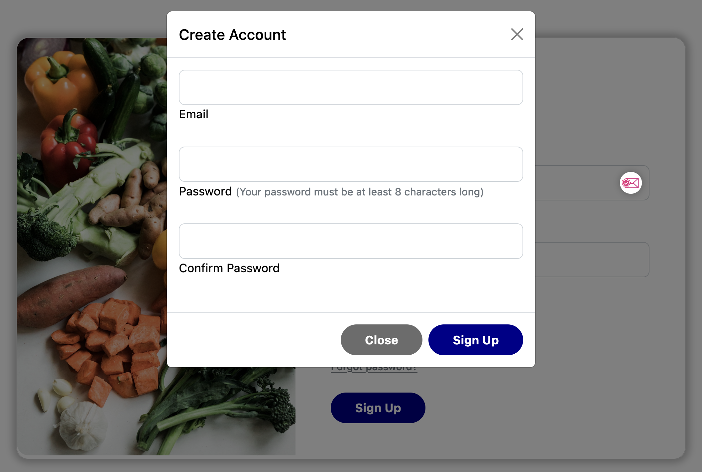
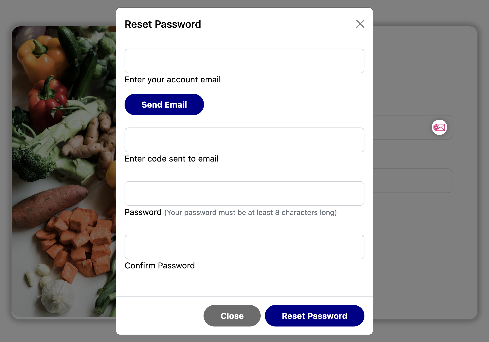

# G.R.I.M.S - General Retail Inventory Management System

## Table of Contents

- [Description](#description)
- [Usage](#usage)
	- [Create an account](#create-an-account)
	- [Resetting your password](#resetting-your-password)
	- [Navigating the dashboard](#navigating-the-dashboard)
	- [Adding a new product](#adding-a-new-product)
	- [Editing and deleting products](#editing-and-deleting-products)
- [Credits](#credits)
- [License](#license)

## Description
G.R.I.M.S is a web-based inventory management system that allows users to create, edit, and delete products. This application is designed to be used by a small business owner who wants to keep track of their inventory. The user can view products organized by different departments, select a product to either edit its information or delete it from the inventory, and add new products. The application utilizies a cloud image hosting solution called [Cloudinary](https://cloudinary.com/). We integrated Cloudinary to allow users to upload images of their products directly from the application because we felt that this would be a more user-friendly solution than having users manually enter a URL for their product images.
 

This application is the minimum viable product (MVP) for a front-end inventory manager. Theoretically G.R.I.M.S could be connected to a database that also hooks up to an in-store Point of Sale system or online e-commerce solution. In its current state it only functions as a demo with it's own database but with further development it could be integrated with other systems.
 

This application is based on **node v16.18.1**. It is built using the **MEHN** stack (MySQL, Express, Handlebars, and Node.js). G.R.I.M.S is deployed on Heroku and can be accessed [here](https://grims-inventory.herokuapp.com/).

## Usage
When you load the [web application](https://grims-inventory.herokuapp.com/) you'll be greeted by a welcome screen and then presented with a login page. You have the option to login, reset your password, or create an account. If you don't have an account you can create one by clicking the **Sign Up** button on the login page. If you have an account but have forgotten your password you can reset it by clicking the **Forgot Password?** link on the login page. Once you have logged in you will be redirected to the dashboard. The dashboard is where you can select a department and view your products, add new products, and edit or delete existing products.

### Creating an account
To create an account, click the **Sign Up** button on the login page. You will be prompted to enter a username and password. Once you have entered your information, click the **Sign Up** button within the form. You will be redirected to the login page. Enter your username and password and click the **Login** button. You will be redirected to the dashboard.
 

### Resetting your password
To reset your password, click the **Forgot Password?** link on the login page. You will be presented with a form where you can enter your email. Once you have entered your email, click the **Send Email** button and check your inbox. You will receive a code that you can input in the form and then choose and confirm your new password. Click **Reset Password** and the login page will reload.
 

### Navigating the dashboard
Once you are logged in the first thing you see is an image carousel that rotates through each department. You are on the dashboard. The dashboard is where you can view your products, add new products, and edit or delete existing products. The dashboard is organized by department. You can select a department from the dropdown menu at the top of the page, or click on the department name from the image carousel. Once you have selected a department you will be presented with an overview of the products within the department as cards. You can click on the **Details** button on a product to edit it's information or delete it from the inventory. You can also add a new product by clicking the **Add New Product** button at the top of the page.
 

https://user-images.githubusercontent.com/39972418/211234275-69de05dc-5874-47d6-8c0f-ca5cef58b0e3.mp4

### Adding a new product
The **Add New Product** button will open a form where you can enter the product's information. Once you have entered the product's information, click the **Save** button to add the product to the inventory. You will be redirected to the dashboard and the product will be displayed as a card. You can click on the **Details** button to edit the product's information or delete it from the inventory.
 

https://user-images.githubusercontent.com/39972418/211234331-ec60fd4c-0820-4552-a200-b4af2b4bee86.mp4

### Editing and deleting products
To edit and delete a products click the **Details** button on the product card to get to that product's page. From there you will have the option to edit and delete that product. Click the **Edit Product** button and you will be presented with a form that allows you to edit the Product Name, Price, and Stock. Click **Confirm** to save your changes. You will be redirected to the product's page. Click the **Delete Product** button to delete the product from the inventory. You will be redirected to the dashboard. You will no longer see that product when you browse products in that department.
 

https://user-images.githubusercontent.com/39972418/211234366-518aa73c-dc6b-4b52-b81f-2e65987961ce.mp4

## Credits
This application uses various open source packages. Below is a list of the packages used in this application and links to their documentation.
 
EmailJS - [https://www.emailjs.com/](https://www.emailjs.com/)
 
Express - [https://expressjs.com/](https://expressjs.com/)
 
Express Handlebars - [https://www.npmjs.com/package/express-handlebars](https://www.npmjs.com/package/express-handlebars)
 
Express Session - [https://www.npmjs.com/package/express-session](https://www.npmjs.com/package/express-session)
 
MySQL2 - [https://www.npmjs.com/package/mysql2](https://www.npmjs.com/package/mysql2)
 
Sequelize - [https://sequelize.org/](https://sequelize.org/)
 
Connect Session Sequelize - [https://www.npmjs.com/package/connect-session-sequelize](https://www.npmjs.com/package/connect-session-sequelize)
 
Bcrypt - [https://www.npmjs.com/package/bcrypt](https://www.npmjs.com/package/bcrypt)
 
Dotenv - [https://www.npmjs.com/package/dotenv](https://www.npmjs.com/package/dotenv)
 
Cloudinary Node SDK - [https://www.npmjs.com/package/cloudinary](https://www.npmjs.com/package/cloudinary)
 
Formidable - [https://www.npmjs.com/package/formidable](https://www.npmjs.com/package/formidable)
 

## License

This application is covered under the [MIT License](https://choosealicense.com/licenses/mit/).
